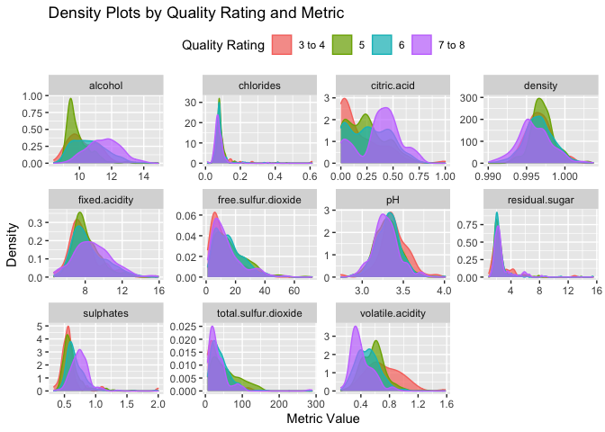
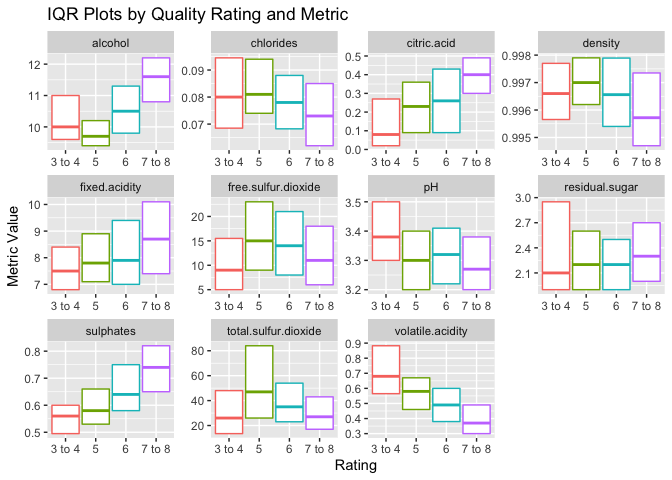
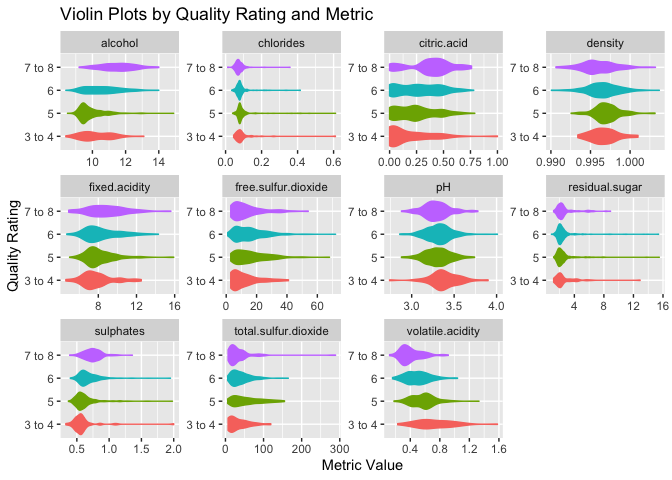
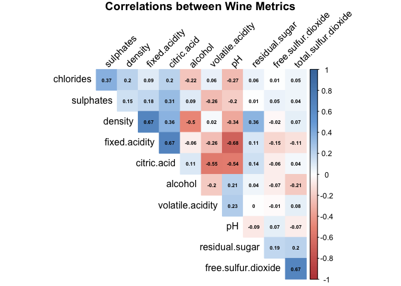
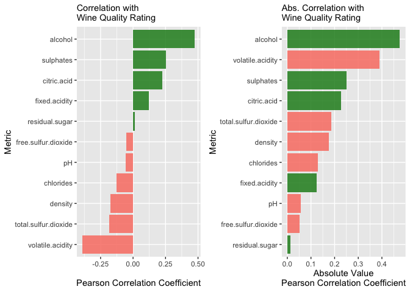
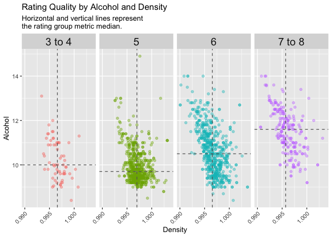
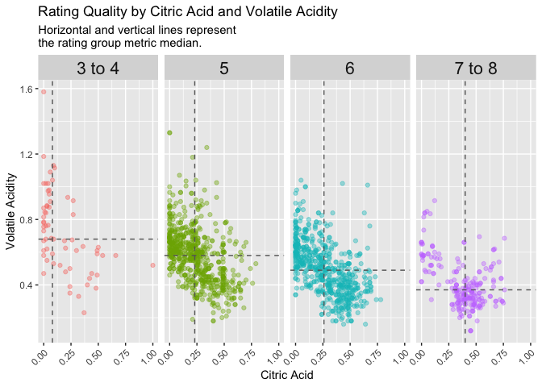

Red Wine Quality: Exploratory Data Visualizations
================
Brian Moore

### Analysis scenario

  - Use data visualizations to investigate which chemical properties
    correlate with higher quality red wine ratings.

### Read in the data

``` r
options(scipen=999)
# warning: running this will install packages on your machine if they aren't present
required_packages <- c('tidyverse', 'dslabs', 'corrplot', 'gridExtra')
for(p in required_packages) {
  if(!require(p,character.only = TRUE)) 
        install.packages(p, repos = "http://cran.us.r-project.org")
  library(p,character.only = TRUE)
}
pct_formater_1 <- scales::label_percent(accuracy = 1)

url <- "https://archive.ics.uci.edu/ml/machine-learning-databases/wine-quality/winequality-red.csv"

rw_df <- read_delim(url, delim=";")

# clean up column names (remove spaces in name)
rw_df <- rw_df %>% dplyr::rename_all(list(~make.names(.)))

# Uncomment lines below to learn more about the red wines dataset
# url_2 <- "https://archive.ics.uci.edu/ml/machine-learning-databases/wine-quality/winequality.names"
# read_lines(url_2)
```

### 10 example observations

``` r
glimpse(head(rw_df, n=10))
```

    ## Rows: 10
    ## Columns: 12
    ## $ fixed.acidity        <dbl> 7.4, 7.8, 7.8, 11.2, 7.4, 7.4, 7.9, 7.3, 7.8, 7.5
    ## $ volatile.acidity     <dbl> 0.70, 0.88, 0.76, 0.28, 0.70, 0.66, 0.60, 0.65, …
    ## $ citric.acid          <dbl> 0.00, 0.00, 0.04, 0.56, 0.00, 0.00, 0.06, 0.00, …
    ## $ residual.sugar       <dbl> 1.9, 2.6, 2.3, 1.9, 1.9, 1.8, 1.6, 1.2, 2.0, 6.1
    ## $ chlorides            <dbl> 0.076, 0.098, 0.092, 0.075, 0.076, 0.075, 0.069,…
    ## $ free.sulfur.dioxide  <dbl> 11, 25, 15, 17, 11, 13, 15, 15, 9, 17
    ## $ total.sulfur.dioxide <dbl> 34, 67, 54, 60, 34, 40, 59, 21, 18, 102
    ## $ density              <dbl> 0.9978, 0.9968, 0.9970, 0.9980, 0.9978, 0.9978, …
    ## $ pH                   <dbl> 3.51, 3.20, 3.26, 3.16, 3.51, 3.51, 3.30, 3.39, …
    ## $ sulphates            <dbl> 0.56, 0.68, 0.65, 0.58, 0.56, 0.56, 0.46, 0.47, …
    ## $ alcohol              <dbl> 9.4, 9.8, 9.8, 9.8, 9.4, 9.4, 9.4, 10.0, 9.5, 10…
    ## $ quality              <dbl> 5, 5, 5, 6, 5, 5, 5, 7, 7, 5

### Summary stats on each of the data variables

``` r
summary(rw_df)
```

    ##  fixed.acidity   volatile.acidity  citric.acid    residual.sugar  
    ##  Min.   : 4.60   Min.   :0.1200   Min.   :0.000   Min.   : 0.900  
    ##  1st Qu.: 7.10   1st Qu.:0.3900   1st Qu.:0.090   1st Qu.: 1.900  
    ##  Median : 7.90   Median :0.5200   Median :0.260   Median : 2.200  
    ##  Mean   : 8.32   Mean   :0.5278   Mean   :0.271   Mean   : 2.539  
    ##  3rd Qu.: 9.20   3rd Qu.:0.6400   3rd Qu.:0.420   3rd Qu.: 2.600  
    ##  Max.   :15.90   Max.   :1.5800   Max.   :1.000   Max.   :15.500  
    ##    chlorides       free.sulfur.dioxide total.sulfur.dioxide    density      
    ##  Min.   :0.01200   Min.   : 1.00       Min.   :  6.00       Min.   :0.9901  
    ##  1st Qu.:0.07000   1st Qu.: 7.00       1st Qu.: 22.00       1st Qu.:0.9956  
    ##  Median :0.07900   Median :14.00       Median : 38.00       Median :0.9968  
    ##  Mean   :0.08747   Mean   :15.87       Mean   : 46.47       Mean   :0.9967  
    ##  3rd Qu.:0.09000   3rd Qu.:21.00       3rd Qu.: 62.00       3rd Qu.:0.9978  
    ##  Max.   :0.61100   Max.   :72.00       Max.   :289.00       Max.   :1.0037  
    ##        pH          sulphates         alcohol         quality     
    ##  Min.   :2.740   Min.   :0.3300   Min.   : 8.40   Min.   :3.000  
    ##  1st Qu.:3.210   1st Qu.:0.5500   1st Qu.: 9.50   1st Qu.:5.000  
    ##  Median :3.310   Median :0.6200   Median :10.20   Median :6.000  
    ##  Mean   :3.311   Mean   :0.6581   Mean   :10.42   Mean   :5.636  
    ##  3rd Qu.:3.400   3rd Qu.:0.7300   3rd Qu.:11.10   3rd Qu.:6.000  
    ##  Max.   :4.010   Max.   :2.0000   Max.   :14.90   Max.   :8.000

### Quality counts

  - The data dictionary indicates quality ratings could range from 0 to
    10.
  - Ratings only range from 3 to 8 for this dataset.
  - Sparse values on the tails.

<!-- end list -->

``` r
rw_df %>% 
  count(quality) %>%
  mutate(percent_total = pct_formater_1(n/sum(n)))
```

    ## # A tibble: 6 x 3
    ##   quality     n percent_total
    ##     <dbl> <int> <chr>        
    ## 1       3    10 1%           
    ## 2       4    53 3%           
    ## 3       5   681 43%          
    ## 4       6   638 40%          
    ## 5       7   199 12%          
    ## 6       8    18 1%

### Create new groups for quality ratings

  - Given the low and high end of the rating scale is less frequent we
    can build a new variable quality\_2 so there’s a higher frequency
    per quality level.

<!-- end list -->

``` r
rw_df <- rw_df %>%
      mutate(quality_2 = case_when(
            quality<=4 ~ "3 to 4",
            quality==5~ "5",
            quality==6 ~ "6",
            quality>6 ~ "7 to 8"),
      quality_2 = factor(quality_2, levels=c("3 to 4", "5", "6", "7 to 8")))

rw_df %>% 
  count(quality_2) %>%
  mutate(percent_total = pct_formater_1(n/sum(n)))
```

    ## # A tibble: 4 x 3
    ##   quality_2     n percent_total
    ##   <fct>     <int> <chr>        
    ## 1 3 to 4       63 4%           
    ## 2 5           681 43%          
    ## 3 6           638 40%          
    ## 4 7 to 8      217 14%

### Distribuion of each variable by quality rating

##### Observations on differences between groups:

  - Alcholol: looks like it tends to be higher for top rated wines.
  - Citric Acid: lowest rating wines seem more likely to have lower
    citric acid.
  - Sulphates: this metric seems to trend higher for top rated wines.
  - Volatile Acidity: tends to be lower for top rated wines.

Histograms not preferred here due to the groups being uneven in size.  
In other words, showing counts via histograms would put the visual
emphasis on the largest group size. Density plots can be tricky for
non-Data folks to grasp. See [Khan Academy: Density
Curves](https://www.khanacademy.org/math/ap-statistics/density-curves-normal-distribution-ap/density-curves/v/density-curves)
for a shareable resource to further intuition.

``` r
rw_df %>%
      select(-quality) %>%
      gather(key="metric", value="value", -quality_2) %>%
      ggplot(aes(x=value, fill=quality_2, color=quality_2)) +
      geom_density(alpha=0.7) +
      facet_wrap(metric ~ ., scale="free") +
      labs(title="Density Plots by Quality Rating and Metric",
           y="Density",
           x="Metric Value",
           fill="Quality Rating",
           color="Quality Rating") +
      theme(legend.position = "top")
```

<!-- -->

### IQR plots

  - Modified boxplots which don’t include whiskers or outliers.
  - Useful to compare the 25%, 50%, 75% quartiles of the data.
  - e.g. chops the tails off the distribution.

##### Observations on differences between groups:

  - IQR plots reflect similar takeaways to the density plots.
  - Slightly higher fixed acidity for top rated wines.
  - Slightly lower PH for top rated wines.

<!-- end list -->

``` r
rw_df %>%
      select(-quality) %>%
      gather(key="metric", value="value", -quality_2) %>%
      group_by(quality_2, metric) %>%
      summarise(y0 = min(value),
                y25 = quantile(value, 0.25),
                y50 = median(value),
                y75 = quantile(value, 0.75),
                y100 = max(value), 
                .groups = 'drop') %>%
      ggplot(aes(x=quality_2, color=quality_2)) +
      geom_boxplot(
         # small hack here: set the min to q25 var and max to q75 var 
         # this prevents the whiskers from showing on the plot
         aes(ymin = y25, lower = y25, middle = y50, upper = y75, ymax = y75),
         stat = "identity") +
      facet_wrap(. ~ metric, scale="free") +
      labs(title="IQR Plots by Quality Rating and Metric",
           y="Metric Value",
           x="Rating",
           fill="Quality Rating",
           color="Quality Rating") +
      theme(legend.position = "none")
```

<!-- -->

### Violin plots

  - Violin plots offer another way to compare distributions across
    groups.
  - These type of charts tend to be informative for a data audience and
    not obvious for non-Data folks.

<!-- end list -->

``` r
rw_df %>%
      select(-quality) %>%
      gather(key="metric", value="value", -quality_2) %>%
      ggplot(aes(x=value, y=quality_2, fill=quality_2, color=quality_2)) +
      geom_violin(draw_quantiles = c(0.25, 0.5, 0.75)) +
      facet_wrap(metric ~ ., scale="free") +
      labs(title="Violin Plots by Quality Rating and Metric",
           y="Quality Rating",
           x="Metric Value") +
      theme(legend.position = "none")
```

<!-- -->

### Correlation plot: wine chemical metrics

  - Investigate which metrics trend together using correlation matrix.
  - Strongest correlation looks to exist between fixed acidity and pH
    metric.

<!-- end list -->

``` r
cor_mat <- cor(rw_df %>% select(-quality_2, -quality))

col <- colorRampPalette(c("#BB4444", "#EE9988", "#FFFFFF", "#77AADD", "#4477AA"))
corrplot(cor_mat, method="color", col=col(200),  
         type="upper", order="hclust", 
         addCoef.col = "black", 
         tl.col="black", tl.srt=45, #Text label color and rotation
         number.cex= 7/ncol(rw_df),
         diag=FALSE,
         title="Correlations between Wine Metrics",
         mar=c(0,0,1,0))
```

<!-- -->

### Correlation plot: quality rating and wine metrics

  - Investigate metric correlations with quality rating.

##### Observations on correlations with quality rating:

  - Alcohol has the strongest positive correlation with wine quality
    rating.
  - Volatile acidity has the strongest negative correlation with wine
    quality rating.

<!-- end list -->

``` r
cor1 <- rw_df %>%
  select(-quality, -quality_2) %>%
  gather(key="metric", value="value") %>%
  group_by(metric) %>%
  summarise(correlation_with_quality = 
              cor(rw_df$quality, 
                  value),
            .groups="drop") %>%
  mutate(color_flag = ifelse(correlation_with_quality<0,"Below_0", "Above_0")) %>%
  ggplot(aes(y=reorder(metric, correlation_with_quality), 
             x=correlation_with_quality,
             fill=color_flag)) +
  geom_col(alpha=0.85) +
  scale_fill_manual(values=c("forestgreen", "salmon")) +
  theme(legend.position = "none") +
  labs(subtitle="Correlation with 
Wine Quality Rating",
       y="Metric",
       x="
Pearson Correlation Coefficient")

cor2 <- rw_df %>%
  select(-quality, -quality_2) %>%
  gather(key="metric", value="value") %>%
  group_by(metric) %>%
  summarise(correlation_with_quality = 
              cor(rw_df$quality, 
                  value),
            .groups="drop") %>%
  mutate(color_flag = ifelse(correlation_with_quality<0,"Below_0", "Above_0"),
         abs_cor = abs(correlation_with_quality)) %>%
  ggplot(aes(y=reorder(metric, abs_cor), 
             x=abs_cor,
             fill=color_flag)) +
  geom_col(alpha=0.85) +
  scale_fill_manual(values=c("forestgreen", "salmon")) +
  theme(legend.position = "none") +
  labs(subtitle ="Abs. Correlation with 
Wine Quality Rating",
       y="Metric",
       x="Absolute Value
Pearson Correlation Coefficient")

grid.arrange(cor1, cor2, ncol=2)
```

<!-- -->

### Bivariate relationship: density and alcohol

  - Top rated wines tend to have higher alcohol compared to other rating
    groups.
  - Density is roughly similar between groups.
  - Negative correlation between alcohol and density.

<!-- end list -->

``` r
rw_df %>% 
  group_by(quality_2) %>%
  mutate(median_density = median(density),
         median_alcohol = median(alcohol)) %>%
  ggplot(aes(x=density, y=alcohol)) +
  geom_point(aes(color=quality_2), alpha=0.4, show.legend = F) +
  geom_vline(aes(xintercept = median_density), linetype="dashed", color="grey40") + 
  geom_hline(aes(yintercept = median_alcohol), linetype="dashed", color="grey40") + 
  facet_wrap(. ~ quality_2, ncol=4) +
  theme(strip.text = element_text(size=16),
        axis.text.x = element_text(angle = 45, hjust = 1, vjust = 1)) +
  labs(title="Rating Quality by Alcohol and Density",
       subtitle="Horizontal and vertical lines represent 
the rating group metric median.",
       y="Alcohol",
       x="Density")
```

<!-- -->

### Bivariate relationship: citric acid and volatile acidity

  - Higher rating quality wines tend to have higher citric acid and
    lower volatile acidity.

<!-- end list -->

``` r
rw_df %>% 
  group_by(quality_2) %>%
  mutate(median_citric.acid = median(citric.acid),
         median_volatile.acidity = median(volatile.acidity)) %>%
  ggplot(aes(x=citric.acid, y=volatile.acidity)) +
  geom_point(aes(color=quality_2), alpha=0.4, show.legend = F) +
  geom_vline(aes(xintercept = median_citric.acid), linetype="dashed", color="grey40") + 
  geom_hline(aes(yintercept = median_volatile.acidity), linetype="dashed", color="grey40") + 
  facet_wrap(. ~ quality_2, ncol=4) +
  theme(strip.text = element_text(size=16),
        axis.text.x = element_text(angle = 45, hjust = 1, vjust = 1)) +
  labs(title="Rating Quality by Citric Acid and Volatile Acidity",
       subtitle="Horizontal and vertical lines represent 
the rating group metric median.",
       y="Volatile Acidity",
       x="Citric Acid")
```

<!-- -->

### Future ideas

  - Is there a more robust wine library dataset that has features on
    soil, climate, wine maker, year, etc?
  - Would grape region have a strong correlation with wine quality
    rating?
  - Create a geo plot and overlay wine ratings on a map?
  - Further explore how chemical properties interact?

### Data source citation

P. Cortez, A. Cerdeira, F. Almeida, T. Matos and J. Reis.  
Modeling wine preferences by data mining from physicochemical
properties.  
In Decision Support Systems, Elsevier, 47(4):547-553. ISSN: 0167-9236.

Available at:  
\[@Elsevier\] <http://dx.doi.org/10.1016/j.dss.2009.05.016>  
\[Pre-press (pdf)\]
<http://www3.dsi.uminho.pt/pcortez/winequality09.pdf>  
\[bib\] <http://www3.dsi.uminho.pt/pcortez/dss09.bib>
